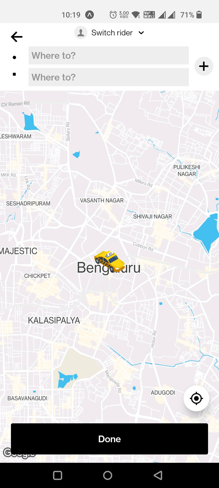
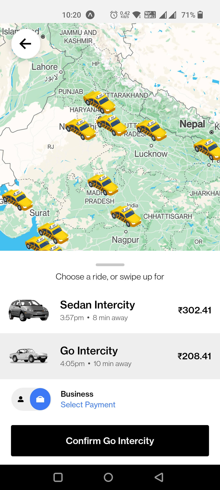

# Uber App Clone (Taxi Booking App)

## Table of contents

- [Overview](#overview)
- [Screenshots](#screenshots)
- [Run the project](#run-the-project)
- [Built with](#built-with)

## Overview

- Uber is a renowned global ride-sharing and transportation network company.
- In the Uber app clone, you will experience a comprehensive range of functionalities similar to the original Uber app.
- To achieve a polished and user-friendly interface, I meticulously designed a series of custom components that replicate the aesthetics of the official Uber app.
- For smooth navigation within the app, I incorporated the React Navigation library, providing users with a well-structured navigation system to effortlessly move between screens and access various app features.
- I made an effort to mirror the design of the original app exactly, ensuring that users feel familiar with the app and can easily navigate through its features.
- The app only has a frontend design at the moment, and dummy data is being pulled from a data file. This allows users to interact with the app and experience its functionalities, even though it does not support real-time ride-hailing.

## Screenshots

<div style="display: grid; grid-template-columns: repeat(3, 1fr); gap: 10px;">
  
  
  
  
  
  
  
  
  
  
  
  
  
  

</div>

## Run the project

First you need to have node and Android Studio install in your machine to run this project and app.
Clone this project and open it on any Code Editor or IDE.
Then run this command.

```
npm i
```

It will install all the dependencies in your system. Then run this command to start the server.

```
npm start
```

Now you can view this app on your Android smartphone or Android Emulator

## Built with

- React Native
- Expo
- Typescript
- React Navigation
- React-Native-Maps
- Styled Components
